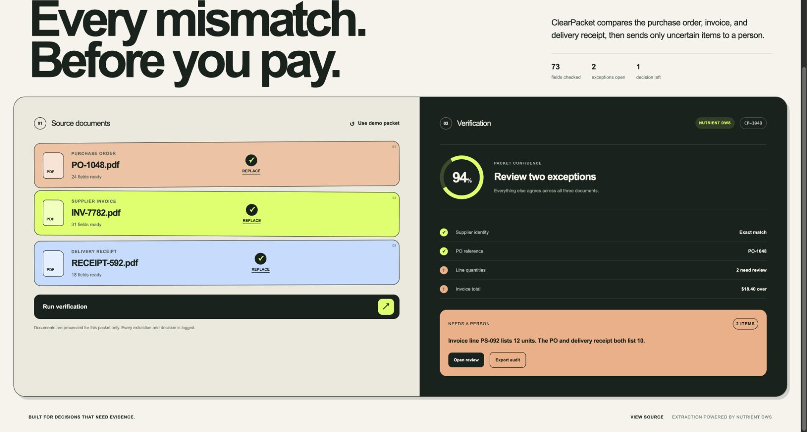

# ClearPacket

ClearPacket is a three-way document verification desk. It extracts a purchase order, supplier invoice, and delivery receipt, compares them with deterministic rules, sends uncertain items to a person, and exports the full audit trail.

Built for the Nutrient DWS and Foxit Software challenges at the DevNetwork API + Cloud + AI Hackathon 2026.

**[Open the live demo](https://clearpacket.hdjskndf.chatgpt.site)**

**[Watch the 2 minute 24 second live walkthrough](https://youtu.be/Tzpq1x9O4jw)**

The hosted demo uses the real Nutrient DWS Processor API for document extraction and audit PDF generation.



## Why it exists

Accounts payable teams should not have to scan three documents line by line to catch a small overbill. ClearPacket lets document extraction handle the reading, deterministic rules handle the comparison, and a person handle only the exception.

The included fictional packet contains one deliberate mismatch: the supplier invoice bills 12 protective sleeves while the purchase order and delivery receipt both show 10. ClearPacket identifies the quantity variance and the resulting $18.40 overage.

## Run locally

1. Install dependencies with `pnpm install`.
2. Copy `.env.example` to `.env.local` and add a Nutrient DWS API key.
3. Start the app with `pnpm dev`.
4. Open `http://localhost:3000`.

Without an API key, the exact included demo packet uses a clearly labeled local demo result. Any uploaded documents require Nutrient DWS.

## Verification flow

1. Upload or open the three source PDFs.
2. Nutrient DWS extracts plain text, structured text, key-value pairs, and tables.
3. ClearPacket checks supplier identity, PO reference, line quantities, and invoice total.
4. A reviewer chooses the payable quantity for the exception.
5. ClearPacket exports the evidence, verification result, extraction engine, and human decision as an audit record.

## Foxit resolution agent

After a person resolves an exception, the optional Foxit agent turns that decision into a supplier credit acknowledgement and creates an embedded human signing session.

The agent uses Foxit's official MCP server for the reversible document work:

1. `upload_document` uploads the generated HTML agreement.
2. `pdf_from_html` creates the signable PDF.
3. `download_document` retrieves the finished PDF.
4. The agent calls Foxit eSign directly to create an embedded signing session with `sendNow: false`.

ClearPacket never signs for a person and never emails the signer automatically. The signer receives a session URL and completes the signature themselves.

Run the safe local preview without credentials:

```bash
pnpm foxit:dry-run
```

For a live test, add the Foxit credentials from the free Developer account, then run:

```bash
pnpm exec node scripts/foxit-resolution-agent.mjs \
  --instruction "Prepare a supplier credit acknowledgement for the reviewed exception." \
  --signer-first "Supplier" \
  --signer-last "Reviewer" \
  --signer-email "signer@example.com"
```

The live run creates a draft embedded session. It does not send an invitation email.

## Demo packet

The repository includes three fictional PDFs in `public/demo/`:

- `PO-1048.pdf`
- `INV-7782.pdf`
- `RECEIPT-592.pdf`

Run the packet as supplied to reproduce the two-unit quantity variance and $18.40 invoice overage.

## Privacy

Uploaded PDFs are processed in memory for the current verification request. ClearPacket does not persist source documents or API keys.
